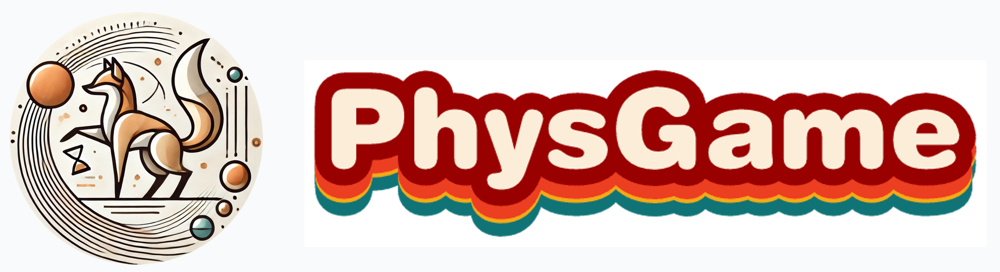
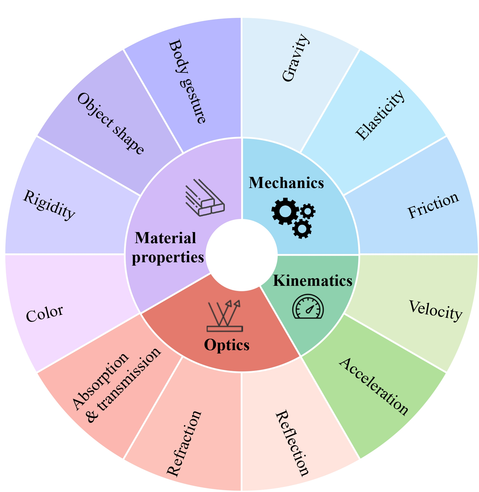
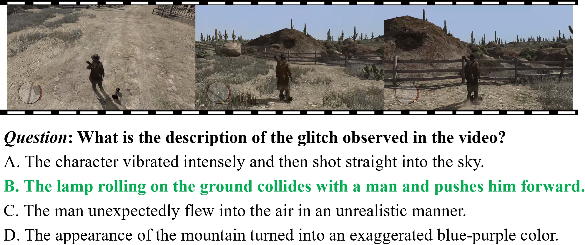
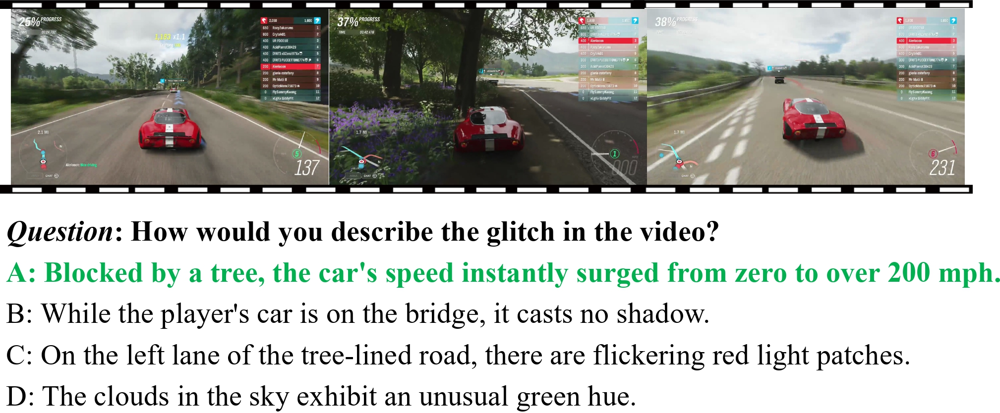
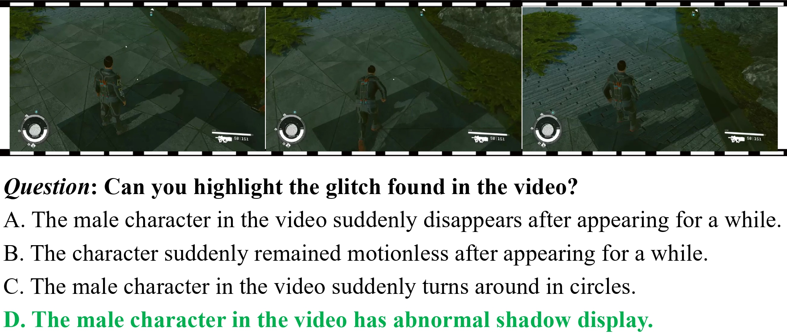
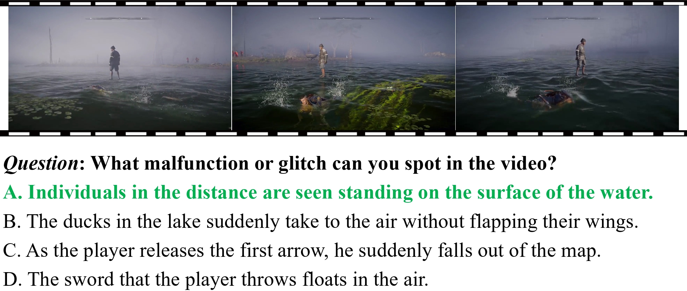

<p align="center" width="100%">
<a target="_blank"></a>
</p>
<h2 align="center"> <a href="https://arxiv.org/abs/2412.01800">PhysGame: Uncovering Physical Commonsense Violations in Gameplay Videos</a></h2>

<h5 align="center"> If you like our project, please give us a star ⭐ on GitHub for the latest update.</h5>

<h5 align=center>

[](https://physgame.github.io/)
[](https://huggingface.co/PhysGame)
[](https://arxiv.org/abs/2412.01800)
[](https://github.com/PhysGame/PhysGame/blob/main/LICENSE)


<!-- 
<font size=7><div align='center' > [[🍎 Project Page](https://video-mme.github.io/)] [[📖 arXiv Paper](https://arxiv.org/pdf/2405.21075)] [[📊 Dataset](https://github.com/BradyFU/Video-MME?tab=readme-ov-file#-dataset)][[🏆 Leaderboard](https://huggingface.co/PhysGame)]  </div></font>
-->

## Latest Updates :loudspeaker:
* **[2024/12/03]**  Project Page and our Leaderboard can be found here!!! [Project Page](https://physgame.github.io/).👀🔥
* **[2024/12/02]**  Data for training and evaluation are released in our [huggingface repo](https://huggingface.co/PhysGame).🤗
* **[2024/12/02]**  We release the 7B training weights of [PhysVLM-DPO](https://huggingface.co/PhysGame/PhysVLM-DPO) and [PhysVLM-SFT](https://huggingface.co/PhysGame/PhysVLM-SFT).🔥🔥
* **[2024/12/02]**  We release PhysGame, which is the first physical commonsense evaluation benchmark based on gameplay videos!🔥🔥
* **[2024/12/02]**  Code are available now! Welcome to **watch** 👀 this repository for the latest updates.
## Overview 👀
Even before language acquisition, children start to grasp fundamental physical commonsense by observing the properties of the world around them. However, acquiring such physical commonsense knowledge remains a major challenge for artificial intelligence systems. For real-world videos, it is both _challenging_  and _unnecessary_ to exhaustively cover and interpret all normal physical phenomena. In contrast, _gameplay videos_ typically contain glitches that violate physical commonsense. This can simplify the definition and evaluation of the physical commonsense understanding, _i.e._, focusing on interpreting physical commonsense violation rather than trying to enumerate all the existing normal physical phenomena. To this end, we curate a suite of datasets including PhysGame for evaluation, PhysInstruct for supervised fine-tuning, PhysDPO for preference alignment. 
* **PhysGame:** The PhysGame benchmark consists of **880** gameplay videos containing glitches, each annotated with a high-quality multiple-choice question specifically addressing the nature of the glitch. PhysGame spans four key physical domains (_i.e._, mechanics, kinematics, optics, and material properties), and encompasses 12 fine-grained categories (_e.g._, gravity and velocity).

* **PhysInstruct:** PhysInstruct is an instruction tuning dataset with 140,057 question-answering pairs focusing on physical commonsense understanding.

* **PhysDPO:** PhysDPO is consisted of 34,358 training pairs with both the preferred and dis-preferred responses for preference optimization.

* **PhysVLM:** Based on these datasets, we propose a **Phy**sical knowledge enhanced large **V**ideo **L**anguage **M**odel (PhysVLM for short), which not only demonstrates state-of-the-art performance on PhysGame but also exhibits leading performance on general video understanding benchmarks.


<p align="center">
    
</p>


## PhysGame Benchmark Examples 📐 
<p align="center">
    
</p>

<div align='center' >
<details>
<summary> Click to expand more examples</summary>
<p align="center">
    
    
    
</details>
</div>


## Benchmark Evaluation :bar_chart:
To evaluate with our **PhysGame** Benchmark, please follow the instructions below:

First download benchmark videos and annotations from [repo](https://huggingface.co/datasets/PhysGame/PhysGame-Benchmark),

Then modify configurations in [evaluate_physgame.sh](https://github.com/PhysGame/PhysGame/blob/main/evaluation/evaluate_physgame.sh)
```bash
--cfg-path config/physvlm_dpo_training.yaml #This depends on the training setting (SFT & DPO)
--ckpt-path /path/to/checkpoints \
--data_anno /path/to/PhysGame_880_annotation.json \
--video_dir /path/to/videos \
```
Finally, run:
```bash
bash evaluation/evaluate_physgame.sh
```
The [Leaderboard]([https://huggingface.co/datasets/PhysGame/PhysGame-Benchmark](https://physgame.github.io/#leaderboard))🥇 is also provided on our website. Please [contact us](mailto:2201111746@stu.pku.edu.cn) if anyone wants to be added.

For [Video-ChatGPT](https://github.com/mbzuai-oryx/Video-ChatGPT) and [Video-MME](https://github.com/BradyFU/Video-MME), please follow their repository to collect the data, then run [evaluate_vcgbench.sh](https://github.com/PhysGame/PhysGame/blob/main/evaluation/evaluate_vcgbench.sh) and [evaluate_videomme.sh](https://github.com/PhysGame/PhysGame/blob/main/evaluation/evaluate_videomme.sh).
## Data Collection & Training 📂:
We provide GamePhysics training data [PhysInstruct](https://huggingface.co/datasets/PhysGame/PhysInstruct-40k) and [PhysDPO](https://huggingface.co/datasets/PhysGame/PhysDPO-10k) for SFT and DPO training mixed with general video datasets.

For more details, please refer to our [paper](https://arxiv.org/abs/2412.01800) and [DATA_Train.md](https://github.com/PhysGame/PhysGame/blob/main/DATA_Train.md).
## Installation 🛠️
**Note** that Qwen-2 requires torch >= 2.1.2 and LLaVA-Onevision requires transformers >= 4.45

For implementation, we use torch==2.1.2 + cu11.8 with transformers==4.45.1

Git clone our repository, create a Python environment, and activate it via the following command
```bash
git clone https://github.com/PhysGame/PhysGame.git
cd PhysGame
conda create --name physvlm python=3.10
conda activate physvlm
pip install -r requirement.txt
```
## Demo 🤗
Feel free to ask PhysVLM about game physics!!!

Please download PhysVLM weights from [PhysVLM-DPO](https://huggingface.co/PhysGame/PhysVLM-DPO) and [PhysVLM-SFT](https://huggingface.co/PhysGame/PhysVLM-SFT) first. Then, run the gradio demo:
```
python demo_gradio.py --ckpt-path /path/to/PhysVLM-DPO --gpu-id 0
```
You can also run the demo with only text outputs:
```
python demo.py --ckpt-path /path/to/PhysVLM-DPO --gpu-id 0
```
## Acknowledgement 👍
Our code is built upon [PPLLaVA](https://github.com/farewellthree/PPLLaVA) and [LLaVA-NeXT](https://github.com/LLaVA-VL/LLaVA-NeXT), thanks for their excellent works!
## Citation ✏️
If you find the code and paper useful for your research, please consider staring this repo and citing our paper:

```
@article{cao2024physgame,
  title={PhysGame: Uncovering Physical Commonsense Violations in Gameplay Videos}, 
  author={Cao, Meng and Tang, Haoran and Zhao, Haoze and Guo, Hangyu and Liu, Jiaheng and Zhang, Ge and Liu, Ruyang and Sun, Qiang and Reid, Ian and Liang, Xiaodan},
  journal={arXiv preprint arXiv:2412.01800},
  year={2024},
}
@article{liu2024ppllava,
  title={PPLLaVA: Varied Video Sequence Understanding With Prompt Guidance},
  author={Liu, Ruyang and Tang, Haoran and Liu, Haibo and Ge, Yixiao and Shan, Ying and Li, Chen and Yang, Jiankun},
  journal={arXiv preprint arXiv:2411.02327},
  year={2024}
}
```
<!--
**PhysGame/PhysGame** is a ✨ _special_ ✨ repository because its `README.md` (this file) appears on your GitHub profile.

Here are some ideas to get you started:

- 🔭 I’m currently working on ...
- 🌱 I’m currently learning ...
- 👯 I’m looking to collaborate on ...
- 🤔 I’m looking for help with ...
- 💬 Ask me about ...
- 📫 How to reach me: ...
- 😄 Pronouns: ...
- ⚡ Fun fact: ...
-->
