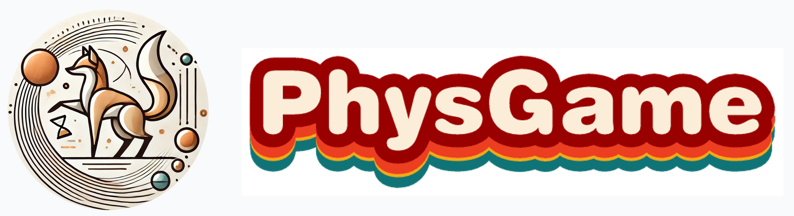

<p align="center" width="100%">
<a target="_blank"></a>
</p>
<h2 align="center"> <a href="https://">PhysGame: Uncovering Physical Commonsense Violations in Gameplay Videos</a></h2>

<h5 align="center"> If you like our project, please give us a star ⭐ on GitHub for the latest update.</h5>

<h5 align=center>

[](https://huggingface.co/PhysGame)
[](https://)
[](https://github.com/PhysGame/PhysGame/blob/main/LICENSE)
## Latest Updates :loudspeaker:
* **[2024/12/02]**  Data for training and evaluation are released in our [huggingface repo](https://huggingface.co/PhysGame).🤗
* **[2024/12/02]**  We release the 7B training weights of [PhysVLM-DPO](https://huggingface.co/PhysGame/PhysVLM-DPO) and [PhysVLM-SFT](https://huggingface.co/PhysGame/PhysVLM-SFT).🔥🔥
* **[2024/12/02]**  We release PhysGame, which is the first physical commonsense evaluation benchmark based on gameplay videos!🔥🔥
* **[2024/12/02]**  Code are available now! Welcome to **watch** 👀 this repository for the latest updates.
## Benchmark Evaluation :bar_chart:
To evaluate with our **PhysGame** Benchmark, please follow the instructions below:

First download benchmark videos and annotations from [repo](https://huggingface.co/datasets/PhysGame/PhysGame-Benchmark),

Then modify configurations in [evaluate_physgame.sh](https://github.com/PhysGame/PhysGame/blob/main/evaluation/evaluate_physgame.sh)
```bash
--cfg-path config/physvlm_dpo_training.yaml #This depends on the training setting (SFT & DPO)
--ckpt-path /path/to/checkpoints \
--data_anno /path/to/PhysGame_880_annotation.json \
--video_dir /path/to/videos \
```
Finally, run:
```bash
bash evaluation/evaluate_physgame.sh
```
The [Leaderboard](https://huggingface.co/datasets/PhysGame/PhysGame-Benchmark)🥇 is also provided on our website. Please [contact us](mailto:2201111746@stu.pku.edu.cn) if anyone wants to be added.
## Data Collection & Training 📂:
We provide GamePhysics training data [PhysInstruct](https://huggingface.co/datasets/PhysGame/PhysInstruct-40k) and [PhysDPO](https://huggingface.co/datasets/PhysGame/PhysDPO-10k) for SFT and DPO training mixed with general video datasets.

For more details, please refer to our [paper](https:) and [DATA_Train.md](https://github.com/PhysGame/PhysGame/blob/main/DATA_Train.md).
## Installation 🛠️
**Note** that Qwen-2 requires torch >= 2.1.2 and LLaVA-Onevision requires transformers >= 4.45

For implementation, we use torch==2.1.2 + cu11.8 with transformers==4.45.1

Git clone our repository, create a Python environment, and activate it via the following command
```bash
git clone https://github.com/PhysGame/PhysGame.git
cd PhysGame
conda create --name physvlm python=3.10
conda activate physvlm
pip install -r requirement.txt
```
## Demo 🤗
Feel free to ask PhysVLM about game physics!!!

Please download PhysVLM weights from [PhysVLM-DPO](https://huggingface.co/PhysGame/PhysVLM-DPO) and [PhysVLM-SFT](https://huggingface.co/PhysGame/PhysVLM-SFT) first. Then, run the gradio demo:
```
python demo_gradio.py --ckpt-path /path/to/PhysVLM-DPO --gpu-id 0
```
You can also run the demo with only text outputs:
```
python demo.py --ckpt-path /path/to/PhysVLM-DPO --gpu-id 0
```
## Acknowledgement 👍
Our code is built upon [PPLLaVA](https://github.com/farewellthree/PPLLaVA) and [LLaVA-NeXT](https://github.com/LLaVA-VL/LLaVA-NeXT), thanks for their excellent works!
## Citation ✏️
If you find the code and paper useful for your research, please consider staring this repo and citing our paper:

```
@article{liu2024ppllava,
  title={PPLLaVA: Varied Video Sequence Understanding With Prompt Guidance},
  author={Liu, Ruyang and Tang, Haoran and Liu, Haibo and Ge, Yixiao and Shan, Ying and Li, Chen and Yang, Jiankun},
  journal={arXiv preprint arXiv:2411.02327},
  year={2024}
}
```
<!--
**PhysGame/PhysGame** is a ✨ _special_ ✨ repository because its `README.md` (this file) appears on your GitHub profile.

Here are some ideas to get you started:

- 🔭 I’m currently working on ...
- 🌱 I’m currently learning ...
- 👯 I’m looking to collaborate on ...
- 🤔 I’m looking for help with ...
- 💬 Ask me about ...
- 📫 How to reach me: ...
- 😄 Pronouns: ...
- ⚡ Fun fact: ...
-->
